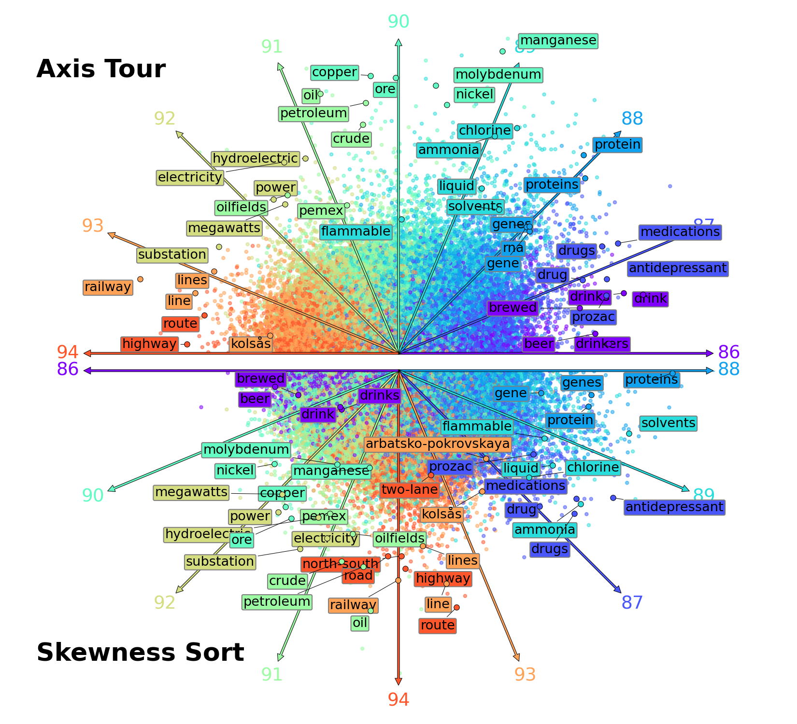

# Axis-Tour

> [Axis Tour: Word Tour Determines the Order of Axes in ICA-transformed Embeddings](https://arxiv.org/abs/2401.06112)                 
> [Hiroaki Yamagiwa](https://ymgw55.github.io/), Yusuke Takase, [Hidetoshi Shimodaira](http://stat.sys.i.kyoto-u.ac.jp/members/shimo/)                 
> *Preprint*



# Code
The source code is being organized and will be available soon. 

# Reference
Sato. Word Tour: One-dimensional Word Embeddings via the Traveling Salesman Problem. NAACL. 2022.

Yamagiwa et al. Discovering Universal Geometry in Embeddings with ICA. EMNLP. 2023.

# Citation
If you find our code or model useful in your research, please cite our paper:
```
@article{DBLP:journals/corr/abs-2401-06112,
  author       = {Hiroaki Yamagiwa and
                  Yusuke Takase and
                  Hidetoshi Shimodaira},
  title        = {Axis Tour: Word Tour Determines the Order of Axes in ICA-transformed
                  Embeddings},
  journal      = {CoRR},
  volume       = {abs/2401.06112},
  year         = {2024},
  url          = {https://doi.org/10.48550/arXiv.2401.06112},
  doi          = {10.48550/ARXIV.2401.06112},
  eprinttype    = {arXiv},
  eprint       = {2401.06112},
  timestamp    = {Thu, 25 Jan 2024 15:41:08 +0100},
  biburl       = {https://dblp.org/rec/journals/corr/abs-2401-06112.bib},
  bibsource    = {dblp computer science bibliography, https://dblp.org}
}
```