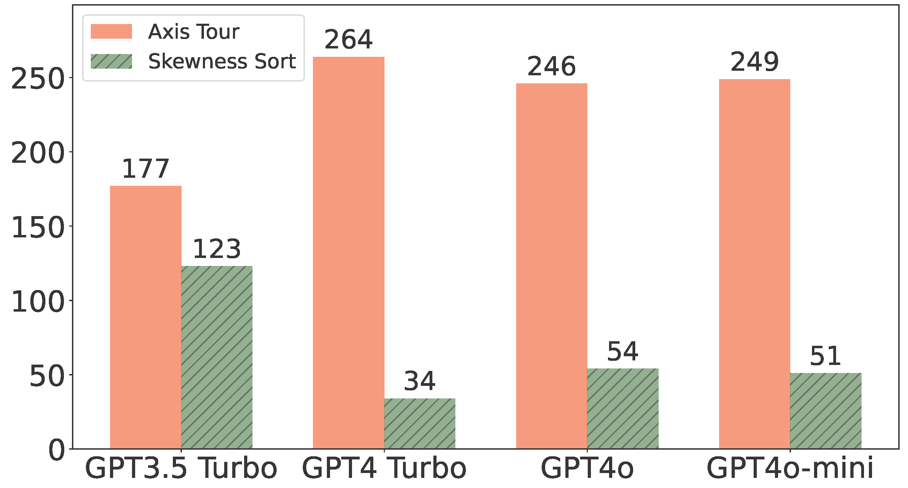

# Axis-Tour

> [Axis Tour: Word Tour Determines the Order of Axes in ICA-transformed Embeddings](https://arxiv.org/abs/2401.06112)         
> [Hiroaki Yamagiwa](https://ymgw55.github.io/), Yusuke Takase, [Hidetoshi Shimodaira](http://stat.sys.i.kyoto-u.ac.jp/members/shimo/)         
> *EMNLP 2024 Findings*

<div align="center">

</div>

---

## Setup

This repository is intended to be run in a Docker environment. If you are not familiar with Docker, please install the packages listed in [requirements.txt](requirements.txt).

### Docker build

Please create a Docker image as follows:

```bash
bash script/docker_build.sh
```

### Environment Variables

```bash
# set OPENAI API key
export OPENAI_API_KEY="sk-***"

# set DOCKER_HOME to your desired home directory in the container
export DOCKER_HOME="path/to/your/docker_home"
```

### Docker run
```bash
bash script/docker_run.sh
```
---

## Preliminary

### Access to the embeddings used in our paper
Instead of recomputing the embeddings, you can access the embeddings used in the paper through the following links. Note that sign flip was not applied to the ICA-transformed embeddings to ensure that the skewness of the axes remains positive.

#### Raw embeddings
- [GloVe (Google Drive)](https://drive.google.com/file/d/1UyP7aDln6YDc17RYtUO1d-hp2Nz2I850/view?usp=drive_link)

Place the downloaded file under the directory `output/raw_embeddings` as shown below:
```bash
$ ls output/raw_embeddings/
raw_glove.pkl
```

#### PCA-transformed and ICA-transformed embeddings
- [GloVe (Google Drive)](https://drive.google.com/file/d/1uKMTWrzTr0aSeJXQco5YDx3PnRbRzlu0/view?usp=drive_link)

Place the downloaded file under the directory `output/pca_ica_embeddings/` as shown below:
```bash
$ ls output/pca_ica_embeddings/
pca_ica_glove.pkl
```

#### Axis Tour embedidngs
- [GloVe (Google Drive)](https://drive.google.com/file/d/1uqwL5zu65SaPG8mjBQfkbuuJ4_09Mhh1/view?usp=drive_link) for $k=100$

Place the downloaded file under the directory `output/axistour_embeddings/` as shown below:
```bash
$ ls output/axistour_embeddings/
axistour_top100_glove.pkl
```

#### POLAR-applied GloVe embeddings (in necessary) [4]
- [POLAR for Random Selection, Variance Maximization, and Orthogonality Maximization (Google Drive)](https://drive.google.com/drive/folders/1LDs0AvOErCApjJ7jR91IlZLIvfOfD_5O?usp=sharing)

Place the downloaded files under the directory `output/polar_glove_embeddings/` as shown below:
```bash
$ ls output/polar_glove_embeddings/
orthogonal_antonymy_gl_500_StdNrml.bin rand_antonym_gl_500_StdNrml.bin variance_antonymy_gl_500_StdNrml.bin
```

### Download GloVe for reproducibility experiments

Create the `data/embeddings` directory:

```bash
mkdir -p data/embeddings
```

Download GloVe embeddings as follows:
```bash
wget https://nlp.stanford.edu/data/glove.6B.zip
unzip glove.6B.zip -d data/embeddings/glove.6B
```
For more details, please refer to the original repository: [stanfordnlp/GloVe](https://github.com/stanfordnlp/GloVe).

### LKH solver for TSP

Similar to [1], download LKH solver for TSP:

```bash
wget http://webhotel4.ruc.dk/~keld/research/LKH-3/LKH-3.0.6.tgz
tar xvfz LKH-3.0.6.tgz
```

### word-embeddings-benchmarks
We have modified the repository [word-embeddings-benchmarks](https://github.com/kudkudak/word-embeddings-benchmarks) [5]. To install it, use the following commands:
```bash
cd word-embeddings-benchmarks
pip install -e .
cd ..
```

---

## Code

### Save embeddings for reproducibility experiments

#### PCA and ICA

Similar to [2], calculate PCA-transformed and ICA-transformed embeddings as follows:

```bash
python save_pca_and_ica_embeddings.py --emb_type glove
```

#### Axis Tour
```bash
python save_axistour_embeddings.py --emb_type glove --topk 100
```

### Scatterplots
This will generate the scatterplot shown above:
```bash
python make_scatterplots.py --emb_type glove --topk 100 --left_axis_index 86 --length 9
```
If you are not using `adjustText==1.0.4`, you may need to manually adjust the position of the text.

### Save top words for Axis Tour embeddings

To save the top 5 words of the Axis Tour embeddings ($k=100$), run the following:

```bash
python save_axistour_top_words.py --emb_type glove --topk 100 --top_words 5
```

The output file will be as follows:

```bash
$ head -n 6 output/axistour_top_words/glove_top100-top5_words.csv
axis_idx,top1_word,top2_word,top3_word,top4_word,top5_word
0,phaen,sandretto,nakhchivan,burghardt,regno
1,region,goriška,languedoc,regions,saguenay-lac-saint-jean
2,mountain,mount,mountains,everest,peaks
3,stage,vinokourov,vuelta,stages,magicians
4,italy,italian,di,francesco,pietro
```


### Histogram of cosine similarities
```bash
python make_cossim_histogram.py --emb_type glove --topk 100
```
<div align="center">

</div>

### Quantitative evaluation of semantic continuity by GPT models

```bash
python eval_continuity_by_OpenAI_API.py
```

<div align="center">

</div>

### Dimensionality reduction

#### Calculate POLAR-applied embeddings (if necessary)

```bash
git clone https://github.com/Sandipan99/POLAR.git
```

Then
```bash
cp polar_glove.ipynb POLAR/
```
Run `POLAR/polar_glove.ipynb` to generate embeddings saved under `output/polar_glove_embeddings/` with the filename `${method}_gl_500_StdNrml.bin`.

#### Evaluation

```bash
python make_dimred_figure.py --emb_type glove --fig_type main 
```

<div align="center">

</div>

### Relation between skewness and the average of two cosine similarities
```bash
python make_relation_skewness_and_two_cossims.py --emb_type glove --topk 100
```


<table>
 <tr>
  <th style="width: 50%;">(a) Axis Tour</th>
 </tr>
 <tr>
  <td>
  <div align="center">
  
  </div>
  </td>
 </tr>
</table>
<table>
 <tr>
  <th style="width: 50%;">(b) Skewness Sort</th>
 </tr>
 <tr>
  <td>
  <div align="center"></td>
  </div>
 </tr>
</table>


---

## Reference

[1] Sato. Word Tour: One-dimensional Word Embeddings via the Traveling Salesman Problem. NAACL. 2022.

[2] Yamagiwa et al. Discovering Universal Geometry in Embeddings with ICA. EMNLP. 2023.

[3] Chelba et al. One billion word benchmark for measuring progress in statistical language modeling. INTER-SPEECH. 2014.

[4] Mathew, et al. The POLAR framework: Polar opposites enable interpretability of pretrained word embeddings. Web Conference. 2020.

[5] Jastrzebski et al. How to evaluate word embeddings? On importance of data efficiency and simple supervised tasks. arXiv. 2017.

---


## Citation

If you find our code or model useful in your research, please cite our paper:
```
@article{DBLP:journals/corr/abs-2401-06112,
  author       = {Hiroaki Yamagiwa and
                  Yusuke Takase and
                  Hidetoshi Shimodaira},
  title        = {Axis Tour: Word Tour Determines the Order of Axes in ICA-transformed Embeddings},
  journal      = {CoRR},
  volume       = {abs/2401.06112},
  year         = {2024},
  url          = {https://doi.org/10.48550/arXiv.2401.06112},
  doi          = {10.48550/ARXIV.2401.06112},
  eprinttype   = {arXiv},
  eprint       = {2401.06112},
  timestamp    = {Sun, 06 Oct 2024 21:24:36 +0200},
  biburl       = {https://dblp.org/rec/journals/corr/abs-2401-06112.bib},
  bibsource    = {dblp computer science bibliography, https://dblp.org}
}
```


---

## Note

- Since the URLs of published embeddings may change, please refer to the GitHub repository URL instead of the direct URL when referencing in papers, etc.
- This directory was created by [Hiroaki Yamagiwa](https://ymgw55.github.io/).
- The code for TICA was created by Yusuke Takase.
- See [README.Appendix.md](README.Appendix.md) for the experiments in the Appendix.